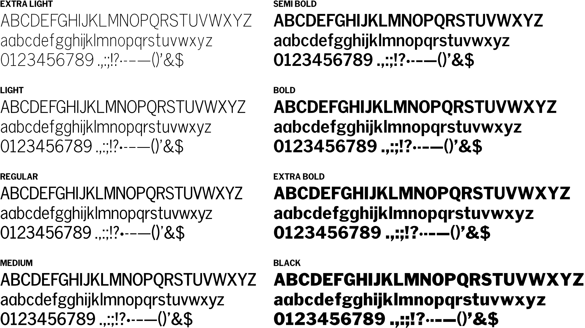

# General Gothic

I've liked Franklin Gothic since encountering it in the late 1980s and early 1990s. It was part of what stoked my interest in design in general, and later font design specifically.

This repository contains my redrawn versions of what was loosely considered the extended ATF Gothic font family -- Lightline Gothic, News Gothic and Franklin Gothic -- used as masters to generate a more complete family from extra light to black.

The extra light weight is Lightline Gothic, regular is News Gothic, and black is Franklin Gothic.

## Disclaimer

This initial version is rough. Nothing has been set up apart from defining the stems. (And some basic kerning it seems.)

The glyph coverage is not even close to what we expect these days -- only Latin uppercase and lowercase, numbers, and basic punctuation. I added alternate single-storey lowercase _a_ and _g_ glyphs, though.

Both the glyph coverage and other refinements such as kerning and hinting will come at some point.

Lastly, these don't _exactly_ match the sources I drew from since I chose to use a slightly larger x-height, and it's consistent between the weights.

## Fonts

General Gothic consists of variable web fonts in extra light to black weights with optical sizes from 6 to 10, and OpenType fonts in extra light to black with an optical size of 10.

The smallest optical size is 20% wider than the regular optical size, similar to what was originally available.

Look in the `fonts/otf/` folder for the desktop fonts, and the `fonts/webfonts/` folder for the web fonts.

## License

Copyright (c) 2023, Barry Mieny (<https://barry.mieny.com>)

This Font Software is licensed under the SIL Open Font License, Version 1.1. This license is included in this repository (OFL.txt) and is also available with an FAQ at: <https://scripts.sil.org/OFL>
